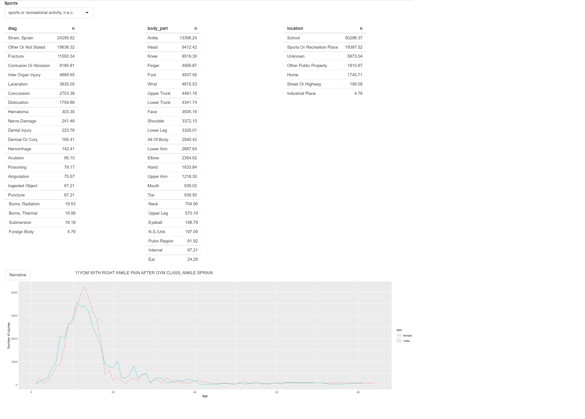

# **Estudo de Caso**

---

## **Introdução**

Vamos fazer um estudo de caso, para ajudá-lo a fixar os conteúdos estudados anteriormente. Agora veremos um aplicativo shiny mais rico que explora um conjunto de dados e reúne muitas das ideias que vimos até agora. Vamos fazer uma pequena análise de dados fora do shiny, em seguida, transformá-lo em um aplicativo, começando de forma simples e progressivamente acrescentando mais detalhes.  

Vamos complementar o shiny com outros pacotes: 

- `tidyverse` para análise geral dos dados(uma coleção de pacotes R projetados para data science).
- `shinydashboard` estrutura shiny dashboard. 
- `shinydashboardPlus` extensões do pacote shinydashboard.
- `shinyjs` operações comuns em JavaScript via código R.
- `ggplot2` para visualização gráfica.
- `forcats` para lidar com variáveis categóricas.


```{r, warning=FALSE, message=FALSE}
# install.packages("tidyverse")
# install.packages("ggplot2")
# install.packages("shinydashboard")
# install.packages("shinydashboardPlus")
# install.packages("shinyjs")
# install.packages("forcats")

library(tidyverse)
library(shiny)
library(ggplot2)
library(shinydashboard)
library(shinydashboardPlus)
library(shinyjs)
library(forcats)
```


## **Descrição dos dados**

Vamos explorar/analisar os dados do Sistema Nacional de Vigilância de Lesões Eletrônicas (NEISS), coletados pela Comissão de Segurança de Produtos de Consumo. Este é um estudo de longo prazo que registra todos os acidentes observados em uma amostra representativa de hospitais nos Estados Unidos. É um conjunto de dados interessante para explorar porque todos já estão familiarizados com o domínio e cada observação é acompanhada por uma breve narrativa que explica como o acidente ocorreu. Você pode descobrir mais sobre este conjunto de dados [aqui](https://github.com/hadley/neiss).

Vamos concentrar apenas nos dados do ano de 2017. [Aqui](https://github.com/hadley/mastering-shiny/blob/master/neiss/data.R) você pode ver o código que foi usado para extrair os dados para a análise.

Obtendo os dados para o computador:


```{r,results='hide', eval = FALSE}
dir.create('neiss')
download <- function(name) {
 url <- 'https://github.com/hadley/mastering-shiny/raw/master/neiss/'
 download.file(paste0(url, name), paste0('neiss/', name), quiet = TRUE)
}
download('injuries.tsv.gz')
download('population.tsv')
download('products.tsv')
```


O dataset `injuries` tem aproximadamente 250.000 observações e 10 variáveis.


```{r, results='hide', warning=FALSE, message=FALSE}
injuries <- readr::read_tsv('neiss/injuries.tsv')
head(injuries)
dim(injuries)
```


Descrição das colunas: 

- `trmt_date` é a data em que a pessoa foi atendida no hospital(e não quando ocorreu o acidente).

- `age` idade.

- `sex` gênero.

- `race` raça.

- `body_part` localização da lesão no corpo.

- `location` local onde ocorreu o acidente.

- `diag` diagnóstico básico da lesão (como fratura ou laceração).

- `prod_code` principal produto associado à lesão.

- `weight` é o peso estatístico que fornece o número estimado de pessoas que sofreriam esse ferimento se este conjunto de dados fosse dimensionado para toda a população dos EUA.

- `narrative` breve história sobre como ocorreu o acidente.

Vamos emparelhar esse dataset `injuries` com os outros dois datasets:

`products` que permite que procuramos o nome do produto no código do produto:


```{r, results='hide', warning=FALSE, message=FALSE}
products <- readr::read_tsv('neiss/products.tsv')
head(products)
```


E o outro dataset é o `population` que informa a população dos EUA em 2017 para cada combinação de idade e sexo:


```{r, results='hide', warning=FALSE, message=FALSE}
population <- readr::read_tsv('neiss/population.tsv')
head(population)
```


## **Transformação e limpeza dos dados**

É uma boa prática antes de qualquer análise ou criação de um aplicativo shiny, darmos uma atenção aos nossos dados. Verificar qual tipo de dado estamos lidando, se tem valores missings, se precisa criar ou remover variáveis, entre outras possibilidades de transformações e limpezas dos dados. Essa é a parte menos glamurosa de qualquer projeto, porém essa etapa é muito importante, pois garante um boa análise e uma boa visualização dos dados. 

Agora vamos fazer as transformações e limpezas necessárias aos dados.

Vamos verificar os tipos de dados: 


```{r, results='hide', warning=FALSE}
str(injuries) 
str(products)
str(population)
```


Presença de valores missing:


```{r, results ='hide', warning=FALSE}
sum(is.na(injuries))
sum(is.na(products))
sum(is.na(population))
```


Nos três datasets não há presença de valores missing. E para o nosso aplicativo não será necessário transformação/limpeza dos dados, só se ao decorrer do desenvolvimento da análise precisar. 


## **Exploração dos dados**

Vamos explorar um pouco os dados, antes de criar o aplicativo.

Vamos extrair um subconjunto dos dados originais, apenas as lesões relacionadas aos esportes. E escolher um desses esporte para fazer a análise. 


```{r, results='hide'}
esportes <- subset(injuries, prod_code == 1200 | prod_code == 1205| prod_code == 1211 |
                   prod_code == 1233 | prod_code == 1267 | prod_code == 1333 | prod_code == 3265|
                     prod_code == 3274 | prod_code == 5034 | prod_code == 5040 | prod_code == 5041)
```


Começaremos examinando apenas as lesões relacionada a um tipo de esporte: **basquete**. Vamos  retirar os ferimentos associado a ele: 


```{r, results='hide'}
basquete <- subset(esportes, prod_code == 1205)
dim(basquete)
```


Observando a localização, parte do corpo e o diagnóstico das lesões relacionadas ao basquete. Observe que o peso pela variável `weight` para que as contagens possam ser interpretadas como o total estimado de lesões em todo os EUA.


```{r, results='hide'}
basquete %>%  count(location, wt = weight, sort = TRUE) 
basquete %>%  count(body_part, wt = weight, sort = TRUE) 
basquete %>%  count(diag, wt = weight, sort = TRUE) 
```


Percebemos que os ferimentos envolvendo basquete ocorrem com frequência em lugares de esportes, óbvio. As partes do corpo mais envolvidas são: tornozelo, dedo, joelho, cabeça; e os diagnósticos parecem bem variados. 

Podemos explorar o padrão de acordo com a idade e o sexo. 


```{r, results='hide'}

padrao <- basquete %>% 
  count(age, sex, wt = weight)

padrao %>% 
  ggplot(aes(age, n, colour = sex)) + 
  geom_line() + 
  labs(y = 'Number of injuries') +
  labs(x = 'Age')
``` 


Vemos um pico atingindo entre 10 aos 20 anos de idade, e esse pico é maior ainda para os homens.

Vamos examinar algumas das narrativas. 


```{r, results='hide'}
basquete %>% 
  sample_n(10) %>% 
  pull(narrative)
```


## **Desenvolvendo o aplicativo Shiny**

Aqui, vou construir um protótipo simples do aplicativo shiny, construindo passo a passo para que você possa entender o funcionamento da mecância básica. 

**Função ui:**


```{r, results='hide'}
# Extraindo um conjunto de dados do dataset products que representa os nomes e os códigos dos esportes

produtcs1 <- subset(products, prod_code == 1200 | prod_code == 1205| prod_code == 1211 
                    | prod_code == 1233 | prod_code == 1267 | prod_code == 1333 | prod_code == 3265 
                    | prod_code == 3274 | prod_code == 5034 | prod_code == 5040 | prod_code == 5041)

prod_codes <- setNames(produtcs1$prod_code, produtcs1$title)
ui <- fluidPage(
  fluidRow(
    column(6,
           selectInput('code', 'Esportes', choices = prod_codes))
  ),
  fluidRow(
    column(4, tableOutput('diag')),
    column(4, tableOutput('body_part')),
    column(4, tableOutput('location'))
  ),
  fluidRow(
    column(12, plotOutput('plot'))
  )
)
```


A função `setNames` e a função `selectInput` irá mostra o nome do esporte na **ui** e retorna o código ao **server**. O código vai criar uma página HTML, dividida em três linhas: 

- primeira linha com uma coluna, que tem uma caixa de seleção para que o usuário possa escolher o esporte. 
- segunda linha com três colunas, que serão ocupadas pelas tabelas.
- terceira linha com uma coluna, que será ocupada pelo gráfico. 

**Função server:**


```{r, results='hide'}
server <- function(input, output, session){
  esporte_escolhido <- reactive(esportes %>% filter(prod_code == input$code))
  output$diag <- renderTable(
    esporte_escolhido() %>%  count(diag, wt = weight, sort = TRUE)
  )
  output$body_part <- renderTable(
    esporte_escolhido() %>% count(body_part, wt = weight, sort = TRUE)
  )
  output$location <- renderTable(
    esporte_escolhido() %>%  count(location, wt = weight, sort = TRUE)
  )
  padrao <- reactive({esporte_escolhido %>% count(age, sex, wt = weight)})
  output$plot <- renderPlot({
    esporte_escolhido () %>%
      count(age, sex, wt = weight) %>% 
      ggplot(aes(age, n, colour = sex)) + 
      geom_line() + 
      labs(y = 'Number of injuries') +
      labs(x = 'Age')
  })
}
shinyApp(ui = ui, server = server)
```


### **Adicionando a Narrativa**

Agora vamos adicionar uma maneira de acessar as narrativas. Adicionamos mais uma linha na função **ui**, com um botão de ação para desencadear uma nova história e exibir a narrativa em `textPutput()`:


```{r, results='hide'}
fluidRow(
    column(2, actionButton('nar', 'Narrative')),
    column(10, textOutput('narrativa'))
  )
```


O `eventReative()` cria uma expresão reativa que só é atualizado quando o botão é clicado ou quando os dados subjacentes são alterados. 


```{r, results='hide', eval = FALSE} 
narrative_sample <- eventReactive(
    list(input$nar, selected()),
    selected() %>% pull(narrative) %>% sample(1)
  )
output$narrativa <- renderText(narrative_sample())
```


O código completo do nosso aplivativo: 


```{r, results='hide'}

ui <- fluidPage(
  fluidRow(
    column(6,
           selectInput('code', 'Sports', choices = prod_codes))
  ),
  fluidRow(
    column(4, tableOutput('diag')),
    column(4, tableOutput('body_part')),
    column(4, tableOutput('location'))
  ),
    fluidRow(
    column(2, actionButton('nar', 'Narrative')),
    column(10, textOutput('narrativa'))
  ),
  fluidRow(
    column(12, plotOutput('plot')))
)
server <- function(input, output, session){
   esporte_escolhido <- reactive(esportes %>% filter(prod_code == input$code))
  output$diag <- renderTable(
    esporte_escolhido() %>%  count(diag, wt = weight, sort = TRUE)
  )
  output$body_part <- renderTable(
    esporte_escolhido() %>% count(body_part, wt = weight, sort = TRUE)
  )
  output$location <- renderTable(
    esporte_escolhido() %>%  count(location, wt = weight, sort = TRUE)
  )
  padrao <- reactive({esporte_escolhido %>% count(age, sex, wt = weight)})
  output$plot <- renderPlot({
    esporte_escolhido () %>%
      count(age, sex, wt = weight) %>% 
      ggplot(aes(age, n, colour = sex)) + 
      geom_line() + 
      labs(y = 'Number of injuries') +
      labs(x = 'Age')
  })
  narrative_sample <- eventReactive(
    list(input$nar, esporte_escolhido()),
    esporte_escolhido() %>% pull(narrative) %>% sample(1)
  )
  output$narrativa <- renderText(narrative_sample())
}
shinyApp(ui = ui, server = server)
```


Essa é a primeira versão do aplicativo shiny:


```{r,  echo=FALSE, fig.cap="Primeira versão do aplicativo", fig.align = 'center', out.width = '100%'}

```