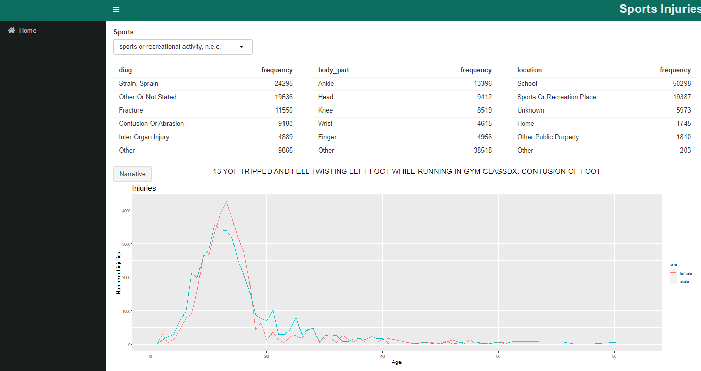

# **Módulos e aparência**

Já temos as funcionalidades básicas funcionando, agora podemos melhorar nosso aplicativo, vamos deixar o nosso código mais legível e de melhor compreensão, para isso vamos usar **módulos**. E depois  salvar os módulos em um arquivo. 

Primeiro vamos construir a função **ui**:


```{r, results='hide'}
analise_ui <- function(id){
  ns <- NS(id)
  prod_codes <- setNames(produtcs1$prod_code, produtcs1$title)
  tabItem(
    tabName = 'home',
    class = 'active',
    fluidRow(
      column(8,
             selectInput(ns('code'), 'Sports', choices = esport_codes))
    ),
    fluidRow(
      column(4, tableOutput(ns('diag'))),
      column(4, tableOutput(ns('body_part'))),
      column(4, tableOutput(ns('location')))
    ),
    fluidRow(
      column(2, actionButton(ns('nar'), 'Narrative')),
      column(10, textOutput(ns('narrativa')))
    ),
    fluidRow(
      column(12, plotOutput(ns('plot')))
    )
  )
}
```


Para a função **server** vamos usar uma função para reduzir as informações que aparecem nas tabelas, utilizando uma combinação de funções do pacote [forcats](https://forcats.tidyverse.org/). Essa função converter as variáveis para o tipo factor, ordena em frequência  e agrupa os níveis após os 5 primeiros. A função automatiza esse processo para qualquer variável: 


```{r, results='hide'}
func_redu <- function(df, var, n = 5) {
  df %>%
    mutate({{var}} := fct_lump(fct_infreq({{var}}), n = n)) %>%
    group_by({{var}}) %>%
    summarise(n = as.integer(sum(weight)))
}
```


Aplicando a função `func_redu` no **server**: 


```{r, results='hide'}
analise_server <- function(input, output, session, dados){
  esporte_escolhido <- reactive(dados %>% filter(prod_code == input$code))
  output$diag <- renderTable(
    func_redu(esporte_escolhido(), diag), width = '100%'
  )
  output$body_part <- renderTable(
    func_redu(esporte_escolhido(), body_part), width = '100%'
  )
  output$location <- renderTable(
    func_redu(esporte_escolhido(), location), width = '100%'
  )
  padrao <- reactive({esporte_escolhido %>% count(age, sex, wt = weight)})
  output$plot <- renderPlot({
    esporte_escolhido () %>%
      count(age, sex, wt = weight) %>% 
      ggplot(aes(age, n, colour = sex)) + 
      geom_line() + 
      labs(y = 'Number of injuries') +
      labs(x = 'Age') +
      ggtitle('Injuries') +
      theme(plot.title = element_text(size = 17))
  })
  narrative_sample <- eventReactive(
    list(input$nar, esporte_escolhido()),
    esporte_escolhido() %>% pull(narrative) %>% sample(1)
  )
  output$narrativa <- renderText(narrative_sample())
}
```


Agora salvamos o script no arquivo `modulos_ui_server.R` e depois construir o aplictaivo com os módulos que acabamos de fazer.


## **Aplicativo Shiny**


```{r, results='hide', warning=FALSE,message=FALSE}
# Carregando os pacotes
library(shiny)
library(shinydashboardPlus)
library(shinydashboard)
library(shinyjs)
library(tidyverse)

# Carregando módulos 
source('modules/modulos_ui_server.R', encoding = 'UTF-8')

# Carregando os dados 
injuries <- readr::read_tsv('neiss/injuries.tsv')
population <- readr::read_tsv('neiss/population.tsv') 
products <- readr::read_tsv('neiss/products.tsv')

esportes <- subset(injuries, prod_code == 1200 | prod_code == 1205| prod_code == 1211 |
                     prod_code == 1233 | prod_code == 1267 | prod_code == 1333 | prod_code == 3265|
                     prod_code == 3274 | prod_code == 5034 | prod_code == 5040 | prod_code == 5041)

produtcs1 <- subset(products, prod_code == 1200 | prod_code == 1205| prod_code == 1211 
                    | prod_code == 1233 | prod_code == 1267 | prod_code == 1333 | prod_code == 3265 
                    | prod_code == 3274 | prod_code == 5034 | prod_code == 5040 | prod_code == 5041)

# Construindo a UI e o SERVER

ui <- dashboardPage(
  dashboardHeader(
    tags$li(
      class = ' dropdown',
      h1(class = 'title-header', 'Sports Injuries'))
  ),
  dashboardSidebar(
    sidebarMenu(
      id = 'tabs',
      menuItem('Home', tabName = 'home', icon = icon('home')))
  ),
  dashboardBody(
    tags$link(rel = "stylesheet", type = "text/css", href = "style.css"),
    useShinyjs(),
    tabItems(
      analise_ui(id = 'home')))
)

server <- function(input, output, dados) { 
  callModule(
    module = analise_server,
    id = 'home',
    dados = esportes
  )
}
shinyApp(ui = ui, server = server)
```


No código acima carreguei os pacotes necessários para o desenvolvimento do aplicativo, a novidade aqui é o pacote `shinyjs`, que permite que você execute operações comuns de JavaScript úteis em aplicativos shiny que irão melhorar o aplicativo. Depois carregamos os módulos e os dados. 

A linha de código `tags$link(rel = 'stylesheet', type = 'text/css', href = 'style_shiny.css')` define o CSS do aplicativo, deixando-o no estilo que você desejar. 

Após aplicar o CSS no aplicativo e organizar os dados em módulos, o aplicativo shiny apresentará essa aparência: 


```{r,  echo=FALSE, fig.cap='Aplicativo Shiny.', fig.align = 'center', out.width = '100%'}

```


A aparência do aplicativo shiny ficou bem mais amigável e agradável. Ao decorrer de um desenvolvimento de aplicativo shiny você tem uma variedade de funções, pacotes que te ajuda a deixar a construir o aplicativo do jeito que desejar, basta usar a sua imaginação e a sua criatividade e colocar a mão na massa. 

Abaixo tem alguns exemplos em Shiny para você se inspirar: 

- https://geom.shinyapps.io/careerpathfinder-beta
- https://vac-lshtm.shinyapps.io/ncov_tracker
- https://ladco.shinyapps.io/NetAssessApp/
- https://connect.thinkr.fr/hexmake/
- https://voronoys.shinyapps.io/voronoys/