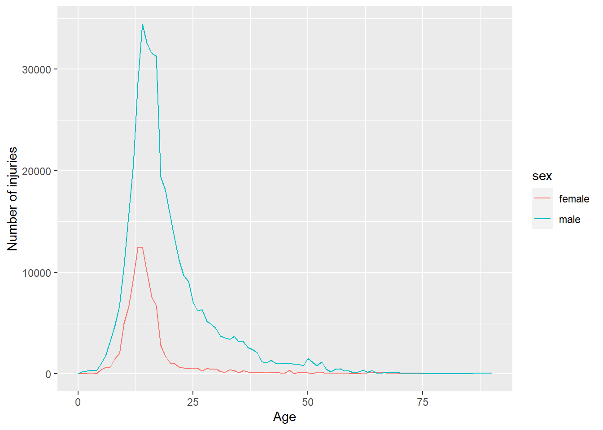

--- 
title: "A Minimal Book Example"
author: "John Doe"
date: "2021-11-06"
site: bookdown::bookdown_site
documentclass: book
bibliography: [book.bib, packages.bib]
# url: your book url like https://bookdown.org/yihui/bookdown
# cover-image: path to the social sharing image like images/cover.jpg
description: |
  This is a minimal example of using the bookdown package to write a book.
  The HTML output format for this example is bookdown::gitbook,
  set in the _output.yml file.
link-citations: yes
github-repo: rstudio/bookdown-demo
---


# Pré-requisitos {-}

---

Conhecimentos básico sna liguaguem R. 

Será útil se você tiver algum conhecimento básico sobre HTML, CSS e JavaScript, pórem não serão obrigatórios.

**Softwares**

* [R](https://www.r-project.org/) Usar a versão mais recente do R.
* [Rstudio](https://www.rstudio.com/) IDE da linguaguem R.
* Navegador da web.


<!--chapter:end:index.Rmd-->

# Introdução 

---

## **O que é Shiny?**

  [Shiny](https://shiny.rstudio.com/) é um framework  para  a criação de aplicativos da web usando código **R**, ele foi desenvolvido principalmente por cientistas de dados. Você pode criar aplicativos **Shiny** bem complicados e interativos sem nenhum conhecimento de HTML, CSS ou JavaScript. O **Shiny** foi projetado para parecer quase que magicamente fácil quando você está começando, e quanto mais você se aprofunda em como ele funciona, mais você percebe que ele é construído a partir de blocos de construção gerais com fortes princípios de engenharia de software por trás dele. Ele não se limita a criar aplicativos triviais; seus componentes de interface de usuário podem ser facilmente customizados ou estendidos, e seu servidor usa programação reativa para permitir que você crie qualquer tipo de lógica de back-end que desejar. 
  
## **Alguns recursos do Shiny**

* Fácil de usar e aprender.

* O tempo do desenvolvimento é minimizado.

* Excelente ferramenta para visualização de dados.

* Tem um apoio forte da linguagem *R*.

* Cria aplicativos da web úteis com apenas algumas linhas de códigos.

* Funciona em qualquer ambiente R (Console R, Rgui para Windows ou Mac, ESS, StatET, RStudio, etc.).

* Os aplicativos Shiny são “ativos” automaticamente. As saídas mudam instantaneamente conforme os usuários modificam as entradas, sem a necessidade de recarregar o navegador.

* As interfaces de usuário Shiny podem ser construídas inteiramente usando R ou podem ser escritas diretamente em HTML, CSS e JavaScript para maior flexibilidade.

* Tema de UI padrão atraente baseado no [Twitter Bootstrap](https://getbootstrap.com/2.0.2/).

* Widgets de saída pré-construídos para exibir gráficos, tabelas e saída impressa de objetos R.

* Comunicação bidirecional rápida entre o navegador da web e R usando o pacote [Websockets](http://illposed.net/websockets.html).

* Usa um modelo de [Programação Reativa](https://en.wikipedia.org/wiki/Reactive_programming) que elimina o código de manipulação de eventos confuso, para que você possa se concentrar no código que realmente importa.

[Folha de dica do Shiny](https://www.rstudio.com/wp-content/uploads/2015/02/shiny-cheatsheet.pdf), este é um ótimo recurso para ajudar a você relembrar alguns dos principais componentes de um aplicativo Shiny. 

<!--chapter:end:01-intro.Rmd-->

# **Aplicativo Shiny**

--- 

Um *aplicativo Shiny* contém duas partes:

* **UI**: (abreviação de user interface), que controla a aparência do aplicativo (fron-end). 

* **SERVER**: que controla a lógica, contém as instruções de que seu computador precisa para construir seu aplicativo (back-end). 

Essa é a essência de um aplicativo Shiny:


```r
# install.packages("shiny")
library(shiny)
ui <- fluidPage(
  # front-end/interface
)
server <- function(input, output, session) {
  # back-end/lógica
}
shinyApp(ui = ui, server = server)
```


A função **server**  monitora a função **ui**.Sempre que houver uma mudança na **ui**, o **server** seguirá algumas instruções (executará algum código R) de acordo e atualizará a exibição dos visuais. Esta é a ideia básica da expressão reativa, que é uma característica distinta do Shiny.


## **Construindo um aplicativo Shiny**

Inicialmente vamos criar um aplicativo shiny simples, o Shiny usa programação reativa para atualizar automaticamente as saídas quando as entradas mudam (vamos ver mais a frente sobre esse conceito e entender seu funcionalidade). 

Instalação do pacote shiny: 


```r
# install.packages('shiny')
```


Carregue o pacote em sua sessão atual do R. 


```r
library(shiny)
```


Agora vamos criar um novo diretório e colocar no nome de `app.R`, esse arquivo será usado para dizer ao Shiny como o aplicativo deve ficar e como deve se comportar. 


```r
library(shiny)
ui <- fluidPage(
   'Hello, world!'
)
server <- function(input, output, session) {
}
shinyApp(ui = ui, server = server)
```


* `library(shiny)` carrega o pacote  Shiny. 

* A  **ui** nesse caso é uma página HTML contendo "Hello World!".

* A função **server** está vazia, no momento, então o aplicativo não faz nada.

* `shiny(ui = ui, server = server)` cria e inicia o aplicativo Shiny a partir do **ui** e do **server**.

Você pode clica em `Run App` na barra de ferramenta para executar o aplicativo ou usar o atalho `Ctrl`+`shift`+ `Enter`.

Pronto, você criou seu primeiro aplicativo em Shiny.

<!--chapter:end:02-aplicativo.Rmd-->

# **Função UI**

---

Vamos adicionar algumas entradas e saídas na função **ui**. Faremos um aplicativo bem simples que mostre os dataframes integrados incluídos no pacote de conjuntos de dados.


```r
library(shiny)
ui <- fluidPage(
  selectInput('dataset', label = 'Datasets', choices = ls('package:datasets')),
  verbatimTextOutput('summary'),
  tableOutput('table')
)
server <- function(input, output, session) {}
shinyApp(ui = ui, server = server)
```


O código acima retorna uma página contendo uma caixa de seleção dos conjuntos dos dados.

*Funções usadas no trecho acima:*

* `fluidPage()` é um controle de layout que configura a estrututa visual básica da página. 

* `selectInput()` é o controle de entrada que permite ao usuário interagir com o aplicativo fornecendo o valor. Nesse caso, é uma caixa de seleção que permite que o usuário escolha um dos conjuntos de dados embutidos que vêm no R. 

* `verbatimTextOutput()` e `tableOutput()` são controles de saída que dizem ao Shiny onde colocar a saída renderizada. `verbatimTextOutput()` exibe códigos e `tableOutput()` exibe tabelas. 


 A **ui** é de fato um arquivo HTML. As funções, entradas e saídas de layout têm usos diferentes, mas são fundamentalmente os mesmos nos bastidores: são apenas maneiras sofisticadas de gerar HTML e, se você chamar qualquer uma delas fora de um aplicativo Shiny, verá uma página HTML impresso no console.

Vemos apenas a entrada porque ainda não dissemos ao Shiny como a entrada e as saídas estão relacionadas.


## **Comportamento da UI**

Agora vamos dizer ao Shiny como a entrada e as saídas estão relacionadas e definir a função **server**. 
O Shiny usa programação reativa para tornar os aplicativos interativos. Que será apresentada mais a frente com mais detalhes.

Diremos ao Shiny como preencher as saídas `summary` e `table` no aplicativo. Substitua sua função **server** vazia por esta:


```r
server <- function(input, output, session) {
    output$summary <- renderPrint({
    dataset <- get(input$dataset, 'package:datasets')
    summary(dataset)
  })
  output$table <- renderTable({
    dataset <- get(input$dataset, 'package:datasets')
    dataset
  })
}
```


*Funções usadas no trecho acima:*

* `output$summary` indica que você está fornecendo como será sua saída do Shiny com esse *summary*. 

* `renderPrint` usa a função de renderização específica para envolver algum código fornecido por você. Cada função `render{Type}` é projetada para produzir um tipo específico de saída (por exemplo, texto, tabelas e gráficos) e geralmente é associada a uma função Output{type}.

Por exemplo, neste aplicativo, `renderPrint()` é pareado com `verbatimTextOutput()` para exibir um resumo estatístico com texto de largura fixa e `renderTable()` é pareado com `tableOutput()` para mostrar os dados de entrada em uma tabela.

Observe que o resumo e a tabela são atualizados sempre que você altera o conjunto de dados de entrada. Essa dependência é criada implicitamente porque nos referimos `input$dataset` nas funções de saída. `input$dataset` é preenchido com o valor atual do componente de **ui** com id dataset e fará com que as saídas sejam atualizadas automaticamente sempre que esse valor mudar. 

Esta é a essência da **reatividade**: *as saídas reagem automaticamente (recalculam) quando suas entradas mudam.*

## **Inputs**

Todas as funções de entrada tem o mesmo primeiro argumento: `inputId`. Este é o identificador usado para conectar o front-end ao back-end: se a UI tiver uma entrada com ID 'name', a função do servidor irá acessá-la com `input$name`.

O `inputId` tem duas restrições:

* Deve ser uma string simples que contém apenas letras, números e sublinhados (sem espaços, travessões, pontos ou outros caracteres especiais permitidos!). Nomeie-o como se fosse uma variável em R.

* Deve ser único. Se não for exclusivo, você não terá como referir-se a esse controle na função **server**. 

A maioria das funções de entrada tem um segundo parâmetro chamado `label`. Isso é usado para criar um rótulo legível para o controle. 

O terceiro parâmetro é normalmente `value`, que quando possível, permite definir o valor padrão. Os parâmetros restantes são exclusivos do controle.

**Algumas funções padrões do Shiny:**


Funções            | Ações
:---------         | :---------
actionButton       | botão de ação.
checkboxGroupInput | um grupo de caixas de seleção.
checkboxInput      | uma única caixa de seleção.
dateInput	         | um calendário para ajudar na seleção de datas.
dateRangeInput     | um par de calendários para selecionar um intervalo de datas.
fileInput          | um assistente de controle de upload de arquivo.
helpText           | texto de ajuda que pode ser adicionado a um formulário de entrada.
numericInput       | um campo para inserir números.
radioButtons       | um conjunto de botões de opção.
selectInput	       | uma caixa com opções para selecionar.
sliderInput        | uma barra deslizante.
submitButton       | um botão de envio.
textInput	         | um campo para inserir texto.


### **Alguns exemplos de Inputs**

#### **Textos livres**

`textInput()` coleta uma pequena quantidade do texto.

`passwordInput()` coleta a senha. 

`textAreaInput()` parágrafo de texto.


```r
library(shiny)
ui <- fluidPage(
  textInput('nome', 'Qual é o seu nome?'),
  passwordInput('senha', 'Por favor inserir a senha:'),
  textAreaInput('anotacao', 'Em que podemos ajudar?')
)
server <- function(input, output, session) {}
shinyApp(ui = ui, server = server)
```


#### **Entradas numéricas** 

`numericInput()` cria uma caixa de texto restrita.

`sliderInput()` controle deslizante e aqui você pode definir um *intervalo* de valores. 


```r
library(shiny)
ui <- fluidPage(
  numericInput('num1', 'Primeiro número', value = 0, min = 0, max = 50),
  sliderInput('num2', 'Segundo número', value = 25, min = 0, max = 50),
  sliderInput('range', 'Intervalo', value = c(10, 20), min = 0, max = 50)
)
server <- function(input, output, session) {}
shinyApp(ui = ui, server = server)
```


#### **Datas**

`dateInput()` seleciona um único dia.

`dateRangeInput()` seleciona um intervalo de dois dias.


```r
library(shiny)
ui <- fluidPage(
  dateInput('primeiro', 'Quando você entrou no seu primeiro emprego?'),
  dateRangeInput('tempo', 'Por quanto tempo ficou nele?')
)
server <- function(input, output, session) {}
shinyApp(ui = ui, server = server)
```


O formato de data, o idioma e o dia em que a semana começa são padronizados para os padrões dos EUA. 
Você pode mudar essas configurações, definindo o `format`, `language`e `weekstart`. 


```r
library(shiny)
ui <- fluidPage(
  dateInput('primeiro', 'Quando entrou no seu primeiro emprego?', format = 'dd-mm-yyyy', language = 'pt-BR', weekstart= 0),
  dateRangeInput('tempo', 'Por quanto tempo ficou no emprego', format = 'dd-mm-yyyy', language = 'pt-BR', weekstart= 0)
)
server <- function(input, output, session) {}
shinyApp(ui = ui, server = server)
```


#### **Botões de ações**

`actionButton()` ou `actionLink()`: permite que o usuário execute uma ação.


```r
library(shiny)
ui <- fluidPage(
  actionButton('click', 'Click me!'),
  actionLink('click2', 'Click me!')
)
server <- function(input, output, session) {}
shinyApp(ui = ui, server = server)
```


Os links e botões de ações são naturalmente emparelhados com `observeEvent()` ou `eventReactive()` em sua função **server**. 

Você pode personalizar a aparência, utilizando o argumento `class`, usando `btn-primary`, `btn-success`, `btn-info`, `btn-warning`, ou `btn-danger`. Você também pode alterar o tamanho, com `btn-lg`, `btn-sm`, ou `btn-xs`. Finalmente, você pode fazer com que os botões ocupem toda a largura do elemento em que estão embutidos `btn-block`.


```r
library(shiny)
ui <- fluidPage(
  fluidRow(
    actionButton('click', 'Click me!', class = 'btn-danger'),
    actionButton('click2', 'Click me!', class = 'btn-lg btn-success')
  ),
  fluidRow(
    actionButton('click3', 'Click me!', class = 'btn-block')
  )
)
server <- function(input, output, session) {}
shinyApp(ui = ui, server = server)
```


Vimos apenas alguns tipos de entradas **ui**. Tem muitas outras funções que você pode experimentar.(Mais contéudos no final do tutorial.) 


<!--chapter:end:03-funcao-ui.Rmd-->

# **Função Server**

---

A função  do **server** contém três parâmetros: `input`, `output`, e `session`. Como você mesmo nunca chama a função do **server**, nunca criará esses objetos sozinhos. Em vez disso, eles são criados pelo Shiny quando a sessão começa, conectando-se de volta a uma sessão específica. Como qualquer outra função do R, quando a função **server** é chamada, ela cria um novo ambiente local que é independente de todas as outras chamadas da função. Isso permite que cada sessão tenha um estado único, além de isolar as variáveis criadas dentro da função. É por isso que quase toda a programação reativa que você fará no Shiny estará dentro da função **server**.

* O `input` é um objeto semelhante a uma lista que contém todos os dados de entradas enviados do navegador, nomeandos de acordo com o ID de entrada. 

* O `output` é bem semelhante ao input; também tem um objeto semelhante a uma lista nomeado de acordo com o ID de saída. A principal diferença é que você o usa para enviar saída em vez de receber entrada. Você sempre usa o objeto `output` em conjunto com uma função `render`. 


## **Outputs**

As saídas na **ui** criam espaços reservados que posteriormente são preenchidos pela função **server**. Como as entradas, as saídas recebem um ID exclusivo como primeiro argumento: se sua especificação de UI criar uma saída com ID 'plot', você a acessará na função de **server** com `output$plot`.

Cada função `output` no front-end é acoplada a uma função `render` no back-end. Existem três tipos principais de saída, correspondendo às três coisas que você geralmente inclui em um relatório: **textos**, **tabelas** e **gráficos**. 

Os pares de funções `output` e `render` que trabalham juntos para adicionar saída de R para o aplicativo shiny:


Função Output       | Função render | Cria
:---                | :---          | :---
htmlOutput/uiOutput | renderUI      | um objeto de tag Shiny ou HTML.
imageOutput         | renderImage	  | imagens (salvas como um link para um arquivo de origem).
plotOutput       	  | renderPlot	  | gráficos.
tableOutput	        | renderTable	  | quadro de dados, matriz, outras estruturas semelhantes a tabelas.
textOutput          | renderText	  | cadeias de caracteres.
verbatimTextOutput  | renderPrint	  | qualquer saída impressa.


### **Alguns exemplos de Outputs**

#### **Textos**

`textOutput()` saída de texto normal.

`verbatimTextOutput()` código fixo e saída de console.

`renderText()` combina o resultado em uma única string e geralmente é pareado com `textOutput`. 

`renderPrint()` imprime o resultado, como se você estivesse em um console R, e geralmente está emparelhado com `verbatimTextOutput`.


```r
library(shiny)
ui <- fluidPage(
  textOutput('texto'),
  verbatimTextOutput('codigo')
)
server <- function(input, output, session) {
  output$texto <- renderText('Hello world!')
  output$codigo <- renderPrint(summary(1:50))
}
shinyApp(ui = ui, server = server)
```


#### **Tabelas**

Existem duas maneiras de exibir um conjunto de dados em tabelas:

* `tableOutput()` e `renderTable()` cria  tabelas de dados estáticas e mostrando todos os dados de uma vez só. É mais útil para resumos pequenos e fixos.

`dataTableOutput()` e `renderDataTable()` cria tabelas dinâmicas, mostrando um número fixo de linhas e controles para alterar as linhas a serem visíveis. É mais útil para visualizar um conjunto de dados completo. 


```r
library(shiny)
ui <- fluidPage(
  tableOutput('linhas'),
  dataTableOutput('dados')
)
server <- function(input, output, session) {
  output$linhas <- renderTable(head(iris))
  output$dados <- renderDataTable(iris, options = list(pageLength = 7))
}
shinyApp(ui = ui, server = server)
```


#### **Gráficos**

Você pode gerar qualquer tipo de gráficos no R(no R base, com pacotes como ggplot2, highcharts e outros) com o `plotOutput()` e `renderPlot()`. 

Por padrão, `plotOutput()` ocupará toda a largura de seu contêiner. Você pode substituir esses padrões com os argumentos `height` e `width`. Os gráficos são saídas que também podem atuar como entradas. 


```r
library(shiny)
ui <- fluidPage(
  plotOutput('plot')
)
server <- function(input, output, session) {
  output$plot <- renderPlot(plot(1:10))
}
shinyApp(ui = ui, server = server)
```

<!--chapter:end:04-funcao-server.Rmd-->

# **Uma breve história da programação reativa**

---

Antes de falarmos da proromação reativa vamos saber um pouco da sua história:


> Se você quiser aprender mais sobre programação reativa em outras linguagens, um pouco de história pode ser útil. Você pode ver a gênese da programação reativa há mais de 40 anos no VisiCalc , a primeira planilha:

> Imaginei um quadro-negro mágico no qual, se você apagasse um número e escrevesse algo novo, todos os outros números mudariam automaticamente, como um processador de texto com números.
- Dan Bricklin 

> As planilhas estão intimamente relacionadas à programação reativa: você declara a relação entre as células usando fórmulas e, quando uma célula muda, todas as suas dependências são atualizadas automaticamente. Então você provavelmente já fez um monte de programação reativa sem saber!

> Embora as ideias de reatividade já existam há muito tempo, foi somente no final da década de 1990 que elas foram seriamente estudadas na ciência da computação acadêmica. Investigação em programação reactiva foi expulso por [Fran](http://conal.net/papers/icfp97/)(**f**unctional **r**eactive **an**imation), um novo sistema para a incorporação de mudanças ao longo do tempo e de entrada de utilizador numa linguagem de programação funcional. Isso gerou uma rica literatura, mas teve pouco impacto na prática da programação.

> Não foi até a década de 2010 que a programação reativa rugiu no mainstream da programação por meio do mundo acelerado das estruturas de interface do usuário JavaScript. Estruturas pioneiras como Knockout , Ember e Meteor (inspiração pessoal de Joe Cheng’s para Shiny) demonstraram que a programação reativa pode tornar a programação da interface do usuário muito mais fácil. Em poucos anos, a programação reativa passou a dominar a programação da web por meio de estruturas extremamente populares como React , Vue.js e Angular , que são todas inerentemente reativas ou projetadas para trabalhar lado a lado com back-ends reativos.

> É importante ter em mente que **programação reativa** é um termo bastante geral. Embora todas as bibliotecas, estruturas e linguagens de programação reativa estejam amplamente preocupadas em escrever programas que respondam a valores variáveis, elas variam enormemente em sua terminologia, designs e implementações.

<!--chapter:end:05-historia.Rmd-->

# **Programação reativa**

---

## **Introdução**

Já foi apresentado a você as principais funções de entradas e saídas que constituem o font-end de um aplicativo Shiny. Agora passaremos para o back-end do aplicativo Shiny: *o código R que dá vida a sua interface de usuário.*

É fácil criar apliactivos interativos com o Shiny, mas para obter o máximo que ele oferece, você precisar entender a estrutura e o funcionamento de **programação reativa** usada pelo Shiny. 

No Shiny, você expressa a lógica do **server** usando programação reativa. A programação reativa é um paradigma de **programação elegante** e **poderosa**, mas pode ser desorientador no início porque é um paradigma muito diferente de escrever um script. A ideia principal da programação reativa é especificar um gráfico de dependências para que, quando uma entrada for alterada, todas as saídas relacionadas sejam atualizadas automaticamente. Isso torna o fluxo de um aplicativo consideravelmente mais simples.


## **Programação reativa**

A verdadeira magia do Shiny acontece quando você tem um aplicatvos com entradas e saídas. Veremos um simples exemplo:


```r
library(shiny)
ui <- fluidPage(
  textInput('nome', 'Qual é o seu nome?'),
  textOutput('saudacao')
)
server <- function(input, output, session) {
  output$saudacao <- renderText({
    paste0('Olá ', input$nome, '!')
  })
}
shinyApp(ui = ui, server = server)
```


Observe com a saída se altera de acordo com a entrada. Esta é a grande ideia do Shiny: você não precisa dizer a uma saída quando atualizar, porque o Shiny descobre isso automaticamente.

**Como funciona? O que exatamente está acontecendo no corpo da função?**

O código não diz ao Shiny para criar a string e enviá-la ao navegador, mas em vez disso, ele informa ao Shiny como ele poderia criar a string se necessário. Depende do Shiny quando e se o código deve ser executado. Ele pode ser executado assim que o aplicativo for iniciado ou pode ser um pouco mais tarde; ele pode ser executado muitas vezes ou nunca! Isso não quer dizer que Shiny seja caprichoso, apenas que é responsabilidade dele decidir quando o código é executado.

## **Programação declarativa vs imperativa**

* Na **programação declarativa** você expressa objetivos de nível superior ou descreve restrições importantes e confia em outra pessoa para decidir como e/ou quando traduzir isso em ação. Este é o estilo de programação que você usa no Shiny.

* Na **programação imperativa** você emite um comando específico e ele é executado imediatamente. Este é o estilo de programação com o qual você está acostumado em seus scripts de análise: você comanda o R para carregar seus dados, transformá-los, visualizá-los e salvar os resultados no disco.

Na maioria das vezes, a programação declarativa é tremendamente libertadora: você descreve seus objetivos gerais e o software descobre como alcançá-los sem intervenção adicional. A desvantagem é o momento ocasional em que você sabe exatamente o que quer, mas não consegue descobrir como enquadrá-lo de uma forma que o sistema declarativo entenda. 

<!--chapter:end:06-programacao-reativa.Rmd-->

# **Expressões reativas**

---
  
Em todo tipo de programação, é uma prática ruim ter código duplicado; pode ser um desperdício computacional e, mais importante, aumenta a dificuldade de manter ou depurar o código. No script R tradicional, usamos duas técnicas para lidar com código duplicado: capturamos o valor usando uma variável ou capturamos o cálculo com uma função. Infelizmente, nenhuma dessas abordagens funciona aqui, e precisamos de um novo mecanismo: **expressões reativas**.

As **expressões reativas** são importantes porque fornecem ao Shiny mais informações para que ele possa fazer menos recomputações quando as entradas mudam, tornando os aplicativos mais eficientes, e tornam mais fácil para os humanos entenderem o aplicativo.

Como entradas, você pode usar os resultados de uma expressão reativa em uma saída. Assim como as saídas, as expressões reativas dependem das entradas e sabem automaticamente quando precisam ser atualizadas.

Você cria uma expressão reativa envolvendo um bloco de código `reactive({...})` e atribuindo a uma variável, e você usa uma expressão reativa chamando  como uma função. Mas, embora pareça que você está chamando uma função, uma expressão reativa tem uma diferença importante: ela só é executada na primeira vez que é chamada e, em seguida, armazena seu resultado em cache até que precise ser atualizado.

Observer o exemplo a seguir: 


```r
library(shiny)

ui <- fluidPage(
  selectInput('dataset', label = 'Dataset', choices = ls('package:datasets')),
  verbatimTextOutput('summary'),
  tableOutput('table')
)
server <- function(input, output, session) {
  output$summary <- renderPrint({
    dataset <- get(input$dataset, 'package:datasets')
    summary(dataset)
  })
  output$table <- renderTable({
    dataset <- get(input$dataset, 'package:datasets')
    dataset
  })
}
shinyApp(ui = ui, server = server)
```


Podemos reduzir esse código atualizando o `server()` para usar expressões reativas. O aplicativo se comporta de forma idêntica, mas funciona com um pouco mais de eficiência, pois só precisa recuperar o conjunto de dados uma vez, não duas.


```r
server <- function(input, output, session) {
  # Criando a expressão reativa
  dataset <- reactive({
    get(input$dataset, 'package:datasets')
  })
  output$summary <- renderPrint({
    #  Use a expressão reativa chamando como uma função
    summary(dataset())
  })
  output$table <- renderTable({
    dataset()
  })
}
```


## **Observers**

Você pode  salvar um arquivo em uma unidade de rede compartilhada, enviar dados para uma API da web, atualizar um banco de dados ou imprimir uma mensagem de depuração no console. Essas ações não afetam a aparência do aplicativo Shiny, portanto, você não deve usar uma saída e uma função `render`. Em vez disso, você precisa usar uma função **observer**.


Um `observer` é como uma expressão reativa, pois pode ler valores reativos e chamar expressões reativas, e será reexecutado automaticamente quando essas dependências forem alteradas. Mas, ao contrário das expressões reativas, não produz um resultado e não pode ser usado como entrada para outras expressões reativas. Assim, os observers são úteis apenas por seus efeitos colaterais.

Outro contraste entre expressões reativas e observers é sua estratégia de execução. Expressões reativas usam avaliação preguiçosa; ou seja, quando suas dependências mudam, eles não são executados imediatamente, mas esperam até serem chamados por outra pessoa. Na verdade, se eles não forem chamados, eles nunca serão executados novamente. Em contraste, os observers usam avaliação ansiosa; assim que suas dependências mudam, eles se programam para uma nova execução.

`observeEvent()` retorna um objeto de classe de referência do observe.

`eventReactive()` retorna um objeto de expressão reativa 

Essas duas funções são muitos semelhantes e tem dois argumentos importantes:

`eventExpre`  que é a entrada ou espressões  da qual depender. 

`handlerExpr` que é o código que será executado. 


```r
library(shiny)

ui <- fluidPage(
  textInput('nome', 'Qual é o seu nome?'),
  textOutput('saudacao')
)
server <- function(input, output, session) {
  string <- reactive(paste0('Hello ', input$nome, '!'))
  
  output$saudacao <- renderText(string())
  observeEvent(input$nome, {
    message('Saudacao realizada')
  })
}
shinyApp(ui = ui, server = server)
```


Observe que a cada letra introduzida na caixa de texto a mensagem *Saudacao realizada* será enviada no console.


## **Diferenças entre expressões reativas e Observers**

As expressões reativas e os observers são semelhantes no sentido de que armazenam expressões que podem ser executadas, mas têm algumas diferenças fundamentais.

- **Observers** respondem a eventos de descarga reativa , mas as expressões reativas  não. Se você deseja que uma expressão reativa seja executada, ela deve ter um observador como descendente no gráfico de dependência reativa.

- As **expressões reativas** retornam valores, mas os observers não.

## **Valores reativos**

Os valores reativos contêm valores, que podem ser lidos por outros objetos reativos. O objeto `input` é um objeto `ReactiveValues` que se parece com uma lista e contém muitos valores reativos individuais. Os valores em `input` são definidos pela entrada do navegador da web.

Existem dois tipos de valores reativos:

- `reactiveVal()` cria um único valor reativo. 

- `reactiveValues()` cria Uma lista de valores reativos. 


```r
library(shiny)

# reactiveVal()
x <- reactiveVal(10)
print(x)
#  reactiveVal: [1] '10'

x(20)
print(x)
#  reactiveVal: [1] '20'

# reactiveValues()
l1 <- reactiveValues(a = 1, b = 2)
isolate(l1$a)
#  [1] 1
isolate(l1$b)
#  [1] 2
```


Eles têm interfaces ligeiramente diferentes para obter e definir valores. No entanto, embora pareçam diferentes, eles se comportam da mesma forma, portanto, você pode escolher entre eles com base na sua preferência. 

Observer o seguinte exemplo: 


```r
x1 <- x2 <- 20
x2 <- 30
print(x1) # valor inalterado
#  [1] 20
```


Obervando o código acima, pode se  dizer que são valores reativos? 
Se sua resposta é *NÃO*, parabéns você acertou. Os valores reativos sempre mantêm uma referência de volta para o mesmo valor, de modo que a modificação de qualquer cópia modifica todos os valores: 


```r
z1 <- z2 <- reactiveValues(a = 10)
z2$a <- 20
isolate(z1$a)
# [1] 20
```


Agora vamos combinar as funções `reactiveValues` e `observeEvent` que pode ser aplicados em alguns casos úteis, resolvendo problemas que não muitos desafiadores. 


```r
library(shiny)
ui <- fluidPage(
  'Total de pontos:',
  textOutput('total', inline = TRUE),
  actionButton('ponto5', 'Adiciona 5 ponto'),
  actionButton('ponto10', 'Adiciona 10 pontos'),
  actionButton('remove', 'Remove 1 ponto')
)
server <- function(input, output, session){
  value <- reactiveValues(total = 0)
  
  observeEvent(input$ponto5, {
    value$total <- value$total + 5
  })
  observeEvent(input$ponto10, {
    value$total <- value$total + 10
  })
  observeEvent(input$remove, {
    value$total <- value$total - 1
  })
  output$total <- renderText({
    value$total
  })
}

shinyApp(ui = ui, server = server)
```


No exemplo temos dois botões que permitem aumentar os valores e um botão que permite diminuir os valores. A função `reactiveValues` foi usada para armazena o valor atual e a função `observeEvent` para aumentar e diminuir o valor quando um botão é presioando. A principal complexidade adicional aqui é que o novo valor de `total()` depende do valor anterior.

<!--chapter:end:07-expressao-reativa.Rmd-->

# **Módulos Shiny**

---

## **Introdução**

Agora vamos falar sobre o sistema de módulos do Shiny, que permite extrair a interface do usuário acoplada e o código do servidor em componentes isolados e reutilizáveis, além de deixar seu aplicativo mais limpo e organizado.

À medida que os aplicativos Shiny ficam maiores e mais complicados, usamos módulos para gerenciar a complexidade crescente do código do aplicativo Shiny.

Um módulo é um par de funções **ui** e funções **server**. A mágica dos módulos vem porque essas funções são construídas de uma maneira especial que cria um “namespace”. Até agora, ao escrever um aplicativo, os nomes dos controles `id`  são globais: todas as partes de sua função **server** podem ver todas as partes de sua ui. Os módulos oferecem a capacidade de criar controles que só podem ser vistos de dentro do módulo. Isso é chamado de namespace porque cria “espaços” de “nomes” que são isolados do resto do aplicativo.

Módulos Shiny têm duas grandes vantagens: 

- O namespacing torna mais fácil entender como seu aplicativo funciona porque você pode escrever, analisar e testar componentes individuais de forma isolada. 

- Como os módulos são funções, eles ajudam a reutilizar o código; tudo o que você pode fazer com uma função, você pode fazer com um módulo.


## **Módulo simples**

Vamos criar um aplicativo bem simples que desenha um histograma, que servirá para ilustrar a mecânica básica do funcionamento do módulo. 


```r
library(shiny)
ui <- fluidPage(
  selectInput('var', 'Variável', names(iris)),
  numericInput('bins', 'bins', 10, min = 1),
  plotOutput('hist')
)
server <- function(input, output, session) {
  data <- reactive(iris[[input$var]])
  output$hist <- renderPlot({
    hist(data(), breaks = input$bins, main = input$var)
  }, res = 96)
}
shinyApp(ui = ui, server = server)
```


Como um aplicativo, o módulo é composto por duas partes:

- A função de interface do usuário do módulo que gera a especificação `ui`.

- A função de servidor do módulo que executa o código dentro da função `server`.

As duas funções possuem formulários padrão. Ambos pegam um argumento `id` e o usam para definir o namespace do módulo. Para criar um módulo, precisamos extrair o código da **ui** do aplicativo e do servidor e colocá-lo na ui do módulo.

### **Módulo UI**

No módulo UI existem duas etapas:

- Coloca o código **ui** dentro de uma função que tenha um argumento `id`.

- Envolva cada ID exsitente em uma chamada `NS()`.

**Obs:** a função `NS()` cria IDs com namepace a partir de IDs vazios, os aplicativos Shiny usam IDs para identificar entradas e saídas. Esses IDs devem ser exclusivos em um aplicativo, pois o uso acidental do mesmo ID de entrada/saída mais de uma vez resultará em um comportamento inesperado. A solução tradicional para evitar conflitos de nomes são os namespaces; um namespace está para um ID como um diretório está para um arquivo. Use a função `NS()` para transformar um ID simples em um espaço de nomes, combinando-os com os intermediários `ns.sep`.


```r
histUI <- function(id) {
  tagList(
    selectInput(NS(id, 'var'), 'Variável', choices = names(iris)),
    numericInput(NS(id, 'bins'), 'bins', value = 10, min = 1),
    plotOutput(NS(id, 'hist'))
  )
}
```


Aqui, os componentes da **ui** foram retornado em a `tagList()`, que é um tipo especial de função de layout que permite agrupar vários componentes sem realmente sugerir como eles serão dispostos. É responsabilidade de quem está ligando `histUI()` envolver o resultado em uma função de layout como `column()` ou de `fluidRow()` acordo com suas necessidades.


### **Módulo Server**

A função **server** é empacotada dentro de outra função que deve ter um argumento `id`. Esta função chama `moduleServer()` com o `id` e uma função que se parece com uma função de servidor normal:


```r
histServer <- function(id) {
  moduleServer(id, function(input, output, session) {
    data <- reactive(iris[[input$var]])
    output$hist <- renderPlot({
      hist(data(), breaks = input$bins, main = input$var)
    }, res = 96)
  })
}
```


Observe que `moduleServer()` cuida do namespace automaticamente: dentro de`moduleServer(id)`, `input$var` e `input$bins` consulta as entradas com nomes `NS(id, 'var')` e `NS(id, 'bins')`.

**Aplicativo atualizado**


```r
histogramApp <- function() {
  ui <- fluidPage(
    histUI('hist1')
  )
  server <- function(input, output, session) {
    histServer('hist1')
  }
  shinyApp(ui = ui, server = server)  
}

histogramApp() # chamando o aplicativo
```


## **Entradas e Saídas**

Os módulos podem representar entrada, saída ou ambos. Eles podem ser tão simples quanto uma única saída ou tão complicados quanto uma interface com várias guias repleta de controles/saídas orientados por múltiplas expressões reativas e observers.

Ás vezes, um módulo com apenas um argumento `id` para o módulo **ui** e o **server** é útil porque permite isolar o código complexo em seu próprio arquivo. Isso é particularmente útil para aplicativos que agregam componentes independentes, como um painel corporativo onde cada guia mostra relatórios personalizados para cada linha de negócios. Aqui, os módulos permitem que você desenvolva cada peça em seu próprio arquivo sem ter que se preocupar com o conflito de IDs entre os componentes.

Muitas vezes, no entanto, o módulo **ui** e o **server** precisarão de argumentos adicionais. Adicionar argumentos à **ui** do módulo oferece maior controle sobre a aparência do módulo, permitindo que você use o mesmo módulo em mais lugares em seu aplicativo. Mas a **ui** do módulo é apenas uma função R regular, portanto, há relativamente pouco a aprender que seja específico do Shiny. Ao contrário do código Shiny regular, conectar módulos requer que você seja explícito sobre entradas e saídas. Inicialmente, isso vai parecer cansativo. E é certamente mais trabalhoso do que a associação de forma livre usual de Shiny. Mas os módulos impõem linhas específicas de comunicação por um motivo: eles são um pouco mais trabalhosos de criar, mas muito mais fáceis de entender e permitem que você crie aplicativos substancialmente mais complexos.

Para ver como as entradas e saídas funcionam, vamos fazer um aplicativo simples, mas que ilustra alguns dos princípios básicos. Vamos criar um módulo que permite ao usuário selecionar um conjunto de dados a partir dos dados integradosfornecidos pelo pacote de conjuntos de dados. 

**Obs**: a função de um módulo **ui** deve ser um nome que é o sufixo `Input`, `Output` ou `UI`; por exemplo, `datasetInput`, `selecNumOutput`, ou `analiseUI`. 

Módulo UI: 


```r
datasetInput <- function(id, filter = NULL) {
  names <- ls('package:datasets')
  if (!is.null(filter)) {
    data <- lapply(names, get, 'package:datasets')
    names <- names[vapply(data, filter, logical(1))]
  }
  selectInput(NS(id, 'dataset'), 'Escolha um conjunto de dados:', choices = names)
}
```


Aqui, usamos um argumento adicional que possa limitar as opções do conjuntos de dados integrados que são data.frame (filter = is.data.frame) ou matrizes (filter = is.matrix). Este argumento filtra opcionalmente os objetos encontrados no pacote de conjuntos de dados e, em seguida, criamos um `selectInput`.  

Módulo Server: 

Usamos o `get` para recuperar o conjunto de dados com seu nome.


```r
datasetServer <- function(id) {
  moduleServer(id, function(input, output, session) {
    reactive(get(input$dataset, 'package:datasets'))
  })
}
```


Criando o aplicativo com os módulos `datasetInput` e `datasetServer`: 


```r
datasetApp <- function(filter = NULL) {
  ui <- fluidPage(
    datasetInput('dataset', filter = filter),
    tableOutput('data')
  )
  server <- function(input, output, session) {
    data <- datasetServer('dataset')
    output$data <- renderTable(head(data()))
  }
  shinyApp(ui = ui, server = server)
}

datasetApp() 
```


Para usar o valor retornado no módulo `datasetServer`, só precisamos capturar o seu valor de retorno com (`data <- datasetServer('dataset')`) e exibimos o conjunto de dados no `tableOutput()`. É necessário um argumento `filter` que é passado para o módulo **ui**, facilitando a experiência com esse argumento de entrada. 

<!--chapter:end:08-modulos.Rmd-->

# **Estudo de Caso**

---

## **Introdução**

Vamos fazer um estudo de caso, para ajudá-los a fixar os conteúdos anteriores. Agora veremos um aplicativo Shiny mais rico que explora um conjunto de dados e reúne muitas das ideias que vimos até agora. Vamos fazer uma pequena análise de dados fora do shiny,em seguida, transformá-lo em um aplicativo, começando de forma simples e progressivamente acrescentando mais detalhes.  

Vamos complementar o Shiny com outros pacotes: 

- `tidyverse` para análise geral dos dados(uma coleção de pacotes R projetados para data science).
- `shinydashboard` estrutura shiny dashboard. 
- `shinydashboardPlus` extensões do pacote shinydashboard.
- `shinyjs` operações comuns em JavaScript via código R.
- `ggplot2` para visualização gráfica.
- `forcats` para lidar com variáveis categóricas.


```r
# install.packages("tidyverse")
# install.packages("ggplot2")
# install.packages("shinydashboard")
# install.packages("shinydashboardPlus")
# install.packages("shinyjs")
# install.packages("forcats")

library(tidyverse)
library(shiny)
library(ggplot2)
library(shinydashboard)
library(shinydashboardPlus)
library(shinyjs)
library(forcats)
```


## **Descrição dos dados**

Vamos explorar/analisar os dados do Sistema Nacional de Vigilância de Lesões Eletrônicas (NEISS), coletados pela Comissão de Segurança de Produtos de Consumo. Este é um estudo de longo prazo que registra todos os acidentes observados em uma amostra representativa de hospitais nos Estados Unidos. É um conjunto de dados interessante para explorar porque todos já estão familiarizados com o domínio e cada observação é acompanhada por uma breve narrativa que explica como o acidente ocorreu. Você pode descobrir mais sobre este conjunto de dados [aqui](https://github.com/hadley/neiss).

Vamos concentrar apenas nos dados do ano de 2017. [Aqui](https://github.com/hadley/mastering-shiny/blob/master/neiss/data.R) você pode ver o código que foi usado para extrair os dados para a análise.

Obtendo os dados para o computador:


```r
dir.create('neiss')
download <- function(name) {
 url <- 'https://github.com/hadley/mastering-shiny/raw/master/neiss/'
 download.file(paste0(url, name), paste0('neiss/', name), quiet = TRUE)
}
download('injuries.tsv.gz')
download('population.tsv')
download('products.tsv')
```


O dataset `injuries` tem cerca de 250.000 observações e 10 variáveis.


```r
injuries <- readr::read_tsv('neiss/injuries.tsv')
head(injuries)
dim(injuries)
```


Descrição das colunas: 

- `trmt_date` é a data em que a pessoa foi atendida no hospital(e não quando ocorreu o acidente).

- `age` idade.

- `sex` gênero.

- `race` raça.

- `body_part` localização da lesão no corpo.

- `location` local onde ocorreu o acidente.

- `diag` diagnóstico básico da lesão (como fratura ou laceração).

- `prod_code` principal produto associado à lesão.

- `weight` é o peso estatístico que fornece o número estimado de pessoas que sofreriam esse ferimento se este conjunto de dados fosse dimensionado para toda a população dos EUA.

- `narrative` breve história sobre como ocorreu o acidente.

Vamos emparelhar esse dataset `injuries` com os outros dois datasets:

`products` que permite que procuramos o nome do produto no código do produto:


```r
products <- readr::read_tsv('neiss/products.tsv')
head(products)
```


E o outro dataset é o `population` que informa a população dos EUA em 2017 para cada combinação de idade e sexo:


```r
population <- readr::read_tsv('neiss/population.tsv')
head(population)
```


## **Transformação e limpeza dos dados**

É uma boa prática antes de qualquer análise ou criação de um aplicativo Shiny, darmos uma atenção aos nossos dados. Verificar qual tipo de dado estamos lidando, se tem valores missings, se precisa criar ou remover variáveis, entre outras possibilidades de transformações e limpezas dos dados. Essa é a parte menos glamurosa de qualquer projeto, porém essa etapa é muito importante, pois garante um boa análise, uma boa visualização dos dados. 

Agora vamos fazer as transformações e limpezas necessárias aos dados.

Vamos verificar os tipos de dados: 


```r
str(injuries) 
str(products)
str(population)
```


Presença de valores missing:


```r
sum(is.na(injuries))
sum(is.na(products))
sum(is.na(population))
```


Nos três datasets não há presença de valores missing. E para o nosso aplicativo não será necessário transformação/limpeza dos dados, só se ao decorrer do desenvolvimento da análise precisar. 


## **Exploração dos dados**

Vamos explorar um pouco os dados, antes de criar o aplicativo.

Vamos extrair um conjunto de dados dos dados originais, extrair apenas as lesões relacionadas aos esportes. E escolher um desses esporte para fazer a análise. 


```r
esportes <- subset(injuries, prod_code == 1200 | prod_code == 1205| prod_code == 1211 |
                   prod_code == 1233 | prod_code == 1267 | prod_code == 1333 | prod_code == 3265|
                     prod_code == 3274 | prod_code == 5034 | prod_code == 5040 | prod_code == 5041)
```


Começaremos examinando apenas as lesões relacionada a um tipo de esporte: **basquete**. Vamos  retirar os ferimentos associado a ele: 


```r
basquete <- subset(esportes, prod_code == 1205)
dim(basquete)
```


Observando a localização, parte do corpo e o diagnóstico das lesões relacionadas ao basquete. Observe que o peso pela variável `weight` para que as contagens possam ser interpretadas como o total estimado de lesões em todo os EUA.


```r
basquete %>%  count(location, wt = weight, sort = TRUE) 
basquete %>%  count(body_part, wt = weight, sort = TRUE) 
basquete %>%  count(diag, wt = weight, sort = TRUE) 
```


Percebemos que os ferimentos envolvendo basquete ocorrem com frequência em lugares de esportes, óbvio. As partes do corpo mais envolvidas são: tornozelo, dedo, joelho, cabeça; e os diagnósticos parecem bem variados. 

Podemos explorar o padrão de acordo com a idade e o sexo. 


```r
padrao <- basquete %>% 
  count(age, sex, wt = weight)

padrao %>% 
  ggplot(aes(age, n, colour = sex)) + 
  geom_line() + 
  labs(y = 'Number of injuries') +
  labs(x = 'Age')
```




Vemos um pico atingindo entre 10 aos 20 anos de idade, e esse pico é maior ainda para os homens.

Vamos examinar algumas das narrativas. 


```r
basquete %>% 
  sample_n(10) %>% 
  pull(narrative)
```


## **Desenvolvendo o aplicativo Shiny**

Aqui, vou construir um protótipo simples do aplicativo Shiny, construindo passo a passo para que você possa entender o funcionamento da mecância básica. 

**Função UI:**


```r
# Extraindo um conjunto de dados do dataset products que representa os nomes e os códigos dos esportes

produtcs1 <- subset(products, prod_code == 1200 | prod_code == 1205| prod_code == 1211 
                    | prod_code == 1233 | prod_code == 1267 | prod_code == 1333 | prod_code == 3265 
                    | prod_code == 3274 | prod_code == 5034 | prod_code == 5040 | prod_code == 5041)

prod_codes <- setNames(produtcs1$prod_code, produtcs1$title)
ui <- fluidPage(
  fluidRow(
    column(6,
           selectInput('code', 'Esportes', choices = prod_codes))
  ),
  fluidRow(
    column(4, tableOutput('diag')),
    column(4, tableOutput('body_part')),
    column(4, tableOutput('location'))
  ),
  fluidRow(
    column(12, plotOutput('plot'))
  )
)
```


A função `setNames` e a função `selectInput` irá mostra o nome do esporte na UI e retorna o código ao **server**. O código vai criar uma página HTML, dividida em três linhas: 

- primeira linha com uma coluna, que tem uma caixa de seleção para que o usuário possa escolher o esporte. 
- segunda linha com três colunas, que serão ocupadas pelas tabelas.
- terceira linha com uma coluna, que será ocupada pelo gráfico. 

**Função server:**


```r
server <- function(input, output, session){
  esporte_escolhido <- reactive(esportes %>% filter(prod_code == input$code))
  output$diag <- renderTable(
    esporte_escolhido() %>%  count(diag, wt = weight, sort = TRUE)
  )
  output$body_part <- renderTable(
    esporte_escolhido() %>% count(body_part, wt = weight, sort = TRUE)
  )
  output$location <- renderTable(
    esporte_escolhido() %>%  count(location, wt = weight, sort = TRUE)
  )
  padrao <- reactive({esporte_escolhido %>% count(age, sex, wt = weight)})
  output$plot <- renderPlot({
    esporte_escolhido () %>%
      count(age, sex, wt = weight) %>% 
      ggplot(aes(age, n, colour = sex)) + 
      geom_line() + 
      labs(y = 'Number of injuries') +
      labs(x = 'Age')
  })
}
shinyApp(ui = ui, server = server)
```


### **Adicionando a Narrativa**

Agora vamos adicionar uma maneira de acessar as narrativas. Adicionamos mais uma linha na função **ui**, com um botão de ação para desencadear uma nova história e exibir a narrativa em `textPutput()`:


```r
fluidRow(
    column(2, actionButton('nar', 'Narrative')),
    column(10, textOutput('narrativa'))
  )
```


O `eventReative()` cria uma expresão reatica que só é atualizado quando o botão é clicado ou quando os dados subjacentes  são alterados. 


```r
narrative_sample <- eventReactive(
    list(input$nar, selected()),
    selected() %>% pull(narrative) %>% sample(1)
  )
output$narrativa <- renderText(narrative_sample())
```


O código completo do nosso aplivativo: 


```r
ui <- fluidPage(
  fluidRow(
    column(6,
           selectInput('code', 'Sports', choices = prod_codes))
  ),
  fluidRow(
    column(4, tableOutput('diag')),
    column(4, tableOutput('body_part')),
    column(4, tableOutput('location'))
  ),
    fluidRow(
    column(2, actionButton('nar', 'Narrative')),
    column(10, textOutput('narrativa'))
  ),
  fluidRow(
    column(12, plotOutput('plot')))
)
server <- function(input, output, session){
   esporte_escolhido <- reactive(esportes %>% filter(prod_code == input$code))
  output$diag <- renderTable(
    esporte_escolhido() %>%  count(diag, wt = weight, sort = TRUE)
  )
  output$body_part <- renderTable(
    esporte_escolhido() %>% count(body_part, wt = weight, sort = TRUE)
  )
  output$location <- renderTable(
    esporte_escolhido() %>%  count(location, wt = weight, sort = TRUE)
  )
  padrao <- reactive({esporte_escolhido %>% count(age, sex, wt = weight)})
  output$plot <- renderPlot({
    esporte_escolhido () %>%
      count(age, sex, wt = weight) %>% 
      ggplot(aes(age, n, colour = sex)) + 
      geom_line() + 
      labs(y = 'Number of injuries') +
      labs(x = 'Age')
  })
  narrative_sample <- eventReactive(
    list(input$nar, esporte_escolhido()),
    esporte_escolhido() %>% pull(narrative) %>% sample(1)
  )
  output$narrativa <- renderText(narrative_sample())
}
shinyApp(ui = ui, server = server)
```


Essa é a primeira versão do aplicativo shiny:


<div class="figure" style="text-align: center">

<p class="caption">(\#fig:unnamed-chunk-18)Primeira versão do aplicativo</p>
</div>

<!--chapter:end:09-estudo-caso.Rmd-->

# **Módulos e aparência**

Já temos as funcionalidades básicas funcionando, agora podemos melhorar nosso aplicativo, vamos deixar o nosso código mais legível e de melhor compreensão, para isso vamos usar **módulos**. E depois  salvar os módulos em um arquivo. 

Primeiro vamos construir a função **ui**:


```r
analise_ui <- function(id){
  ns <- NS(id)
  prod_codes <- setNames(produtcs1$prod_code, produtcs1$title)
  tabItem(
    tabName = 'home',
    class = 'active',
    fluidRow(
      column(8,
             selectInput(ns('code'), 'Sports', choices = esport_codes))
    ),
    fluidRow(
      column(4, tableOutput(ns('diag'))),
      column(4, tableOutput(ns('body_part'))),
      column(4, tableOutput(ns('location')))
    ),
    fluidRow(
      column(2, actionButton(ns('nar'), 'Narrative')),
      column(10, textOutput(ns('narrativa')))
    ),
    fluidRow(
      column(12, plotOutput(ns('plot')))
    )
  )
}
```


Para a função **server** vamos usar uma função para reduzir as informações que aparecem nas tabelas, utilizando uma combinação de funções do pacote [forcats](https://forcats.tidyverse.org/). Essa função converter as variáveis para o tipo factor, ordena em frequência  e agrupa os níveis após os 5 primeiros. A função automatiza esse processo para qualquer variável: 


```r
func_redu <- function(df, var, n = 5) {
  df %>%
    mutate({{var}} := fct_lump(fct_infreq({{var}}), n = n)) %>%
    group_by({{var}}) %>%
    summarise(n = as.integer(sum(weight)))
}
```


Aplicando a função `func_redu` no **server**: 


```r
analise_server <- function(input, output, session, dados){
  esporte_escolhido <- reactive(dados %>% filter(prod_code == input$code))
  output$diag <- renderTable(
    func_redu(esporte_escolhido(), diag), width = '100%'
  )
  output$body_part <- renderTable(
    func_redu(esporte_escolhido(), body_part), width = '100%'
  )
  output$location <- renderTable(
    func_redu(esporte_escolhido(), location), width = '100%'
  )
  padrao <- reactive({esporte_escolhido %>% count(age, sex, wt = weight)})
  output$plot <- renderPlot({
    esporte_escolhido () %>%
      count(age, sex, wt = weight) %>% 
      ggplot(aes(age, n, colour = sex)) + 
      geom_line() + 
      labs(y = 'Number of injuries') +
      labs(x = 'Age') +
      ggtitle('Injuries') +
      theme(plot.title = element_text(size = 17))
  })
  narrative_sample <- eventReactive(
    list(input$nar, esporte_escolhido()),
    esporte_escolhido() %>% pull(narrative) %>% sample(1)
  )
  output$narrativa <- renderText(narrative_sample())
}
```


Agora salvamos o script no arquivo `modulos_ui_server.R` e depois construir o aplictaivo com os módulos que acabamos de fazer.


## **Aplicativo Shiny**


```r
# Carregando os pacotes
library(shiny)
library(shinydashboardPlus)
library(shinydashboard)
library(shinyjs)
library(tidyverse)

# Carregando módulos 
source('modules/modulos_ui_server.R', encoding = 'UTF-8')

# Carregando os dados 
injuries <- readr::read_tsv('neiss/injuries.tsv')
population <- readr::read_tsv('neiss/population.tsv') 
products <- readr::read_tsv('neiss/products.tsv')

esportes <- subset(injuries, prod_code == 1200 | prod_code == 1205| prod_code == 1211 |
                     prod_code == 1233 | prod_code == 1267 | prod_code == 1333 | prod_code == 3265|
                     prod_code == 3274 | prod_code == 5034 | prod_code == 5040 | prod_code == 5041)

produtcs1 <- subset(products, prod_code == 1200 | prod_code == 1205| prod_code == 1211 
                    | prod_code == 1233 | prod_code == 1267 | prod_code == 1333 | prod_code == 3265 
                    | prod_code == 3274 | prod_code == 5034 | prod_code == 5040 | prod_code == 5041)

# Construindo a UI e o SERVER

ui <- dashboardPage(
  dashboardHeader(
    tags$li(
      class = ' dropdown',
      h1(class = 'title-header', 'Sports Injuries'))
  ),
  dashboardSidebar(
    sidebarMenu(
      id = 'tabs',
      menuItem('Home', tabName = 'home', icon = icon('home')))
  ),
  dashboardBody(
    tags$link(rel = "stylesheet", type = "text/css", href = "style.css"),
    useShinyjs(),
    tabItems(
      analise_ui(id = 'home')))
)

server <- function(input, output, dados) { 
  callModule(
    module = analise_server,
    id = 'home',
    dados = esportes
  )
}
shinyApp(ui = ui, server = server)
```


No código acima carreguei os pacotes necessários para o desenvolvimento do aplicativo, a novidade aqui é o pacote `shinyjs`, que permite que você execute operações comuns de JavaScript úteis em aplicativos Shiny que irão melhorar muito seus aplicativos. Depois carrego os módulos e os dados. 

A linha de código `tags$link(rel = 'stylesheet', type = 'text/css', href = 'style_shiny.css')` define o CSS do aplicativo, deixando-o no estilo que você desejar. 

Após aplicar o CSS no aplicativo e organizar os dados em módulos, o aplicativo shiny apresentará essa aparência: 


<div class="figure" style="text-align: center">

<p class="caption">(\#fig:unnamed-chunk-5)Aplicativo Shiny.</p>
</div>


A aparência do aplicativo Shiny ficou bem mais amigável e agradável. Ao decorrer de um desenvolvimento de aplicativo Shiny você tem uma variedade de funções, pacotes que te ajuda a deixar a construir o aplicativo do jeito que desejar, basta usar a sua imagimação e a sua criatividade e colocar a mão na massa. 

Abaixo vou listar alguns exemplos em Shiny para você se inspirar: 

- https://geom.shinyapps.io/careerpathfinder-beta
- https://vac-lshtm.shinyapps.io/ncov_tracker
- https://ladco.shinyapps.io/NetAssessApp/
- https://connect.thinkr.fr/hexmake/
- https://voronoys.shinyapps.io/voronoys/

<!--chapter:end:10-modulo-aparencia.Rmd-->

# **Extensões Shiny**

---

Uma lista de recursos, pacotes, livros que oferecem interface estendida ou componetes de servidor para R Shiny. 

- [Comunidades](#comunidades)
- [Pacotes](#pacotes)
- [Livros](#livros)
- [Vídeos](#vídeos)


## **Comunidades**

- [RStudio Community - Shiny](https://community.rstudio.com/latest)
- [Shiny Server Forum](https://support.rstudio.com/hc/en-us/sections/204025308-Shiny-Server)
- [R-bloggers](https://www.r-bloggers.com/2020/05/powerful-package-for-machine-learning-hyperparameter-tuning-grid-random-search-shiny-app/)
- [Google Group](https://groups.google.com/g/shiny-discuss?pli=1)
- [rOpenSci](https://ropensci.org/)
- [R-Shiny on Reddit](https://www.reddit.com/r/rshiny/)
- [RGov - Government network for R/Shiny](https://rdotgov.wordpress.com/deploy-shiny/)


## **Pacotes**

- [shinydashboard](http://rstudio.github.io/shinydashboard/) - Estrutura Shiny Dashboard.

- [fontawesome](https://rstudio.github.io/fontawesome/) - Insira facilmente ícones FontAwesome em documentos R Markdown e aplicativos Shiny.

- [shinythemes](http://rstudio.github.io/shinythemes/) - Temas de bootstrap para uso com no Shiny.

- [dashboardthemes](https://nik01010.wordpress.com/) - Um pacote R experimental para fornecer opções de tema personalizado para aplicativos Shinydashboard.

- [shinyAce](http://trestletech.github.io/shinyAce/) - Permite que os desenvolvedores de aplicativos Shiny usem o editor de texto [Ace](https://ace.c9.io/#nav=about) em seus aplicativos.

- [shinyjs](https://deanattali.com/shinyjs/) - Operações comuns em JavaScript no Gloss via código R.

- [colourpicker](https://daattali.com/shiny/colourInput/) - Widget seletor de cores que pode ser usado em diferentes contextos em R.

- [ShinySky](https://github.com/AnalytixWare/ShinySky) - Vários widgets/componentes de UI que não fazem parte do Shiny, por exemplo, alertas, botões estilizados.

- [radiant](https://radiant-rstats.github.io/docs/) - Análise de negócios usando R e Shiny.

- [shinyTree](https://github.com/shinyTree/shinyTree) - Permite que os desenvolvedores de aplicativos Shiny usem a biblioteca jsTree em seus aplicativos.

- [shinystan](https://mc-stan.org/users/interfaces/shinystan.html) - Fornece resumos visuais e numéricos dos parâmetros do modelo e diagnósticos de convergência para simulações MCMC.

- [shinyjqui](https://yang-tang.github.io/shinyjqui/) - Interações e efeitos de interface do jQuery para o Shiny.

- [bsplus](http://ijlyttle.github.io/bsplus/) - Complementos Shiny e R Markdown para Bootstrap 3.

- [shinyFiles](https://github.com/thomasp85/shinyFiles) - Estende a funcionalidade de Shiny fornecendo uma API para acesso do lado do cliente ao sistema de arquivos do servidor.

- [shinyDND](https://github.com/ayayron/shinydnd) - Crie elementos de arrastar e soltar no Shiny em R.

- [shinyforms](https://github.com/daattali/shinyforms) -  Crie facilmente formulários do tipo questionário com o Shiny.

- [ECharts2Shiny](https://github.com/XD-DENG/ECharts2Shiny) - Insira gráficos interativos do ECharts no Shiny.

- [shinyFeedback](https://merlinoa.github.io/shinyFeedback/) - Exibe o feedback do usuário junto com as entradas laterais do Shiny.

- [shinycssloader](https://github.com/daattali/shinycssloaders) - Adiciona animações do carregador CSS às saídas do Shiny.

- [directoryInput](https://github.com/wleepang/shiny-directory-input) - Widget para seleção interativa de diretórios.

- [shinymaterial](https://ericrayanderson.github.io/shinymaterial/) - Implementa o Google Material Design em aplicativos Shiny.

- [shinysense](http://nickstrayer.me/shinysense/) - Série de módulos Shiny.

- [shinyWidgets](https://dreamrs.github.io/shinyWidgets/index.html) - Amplie os widgets de entrada disponíveis no Shiny.

- [ggedit](https://yonicd.github.io/ggedit/) - Um gadget Shiny para explorar objetos ggplot.

- [shinytest](https://rstudio.github.io/shinytest/) - Teste automatizado para aplicativos Shiny.

- [shinyloadtest](https://rstudio.github.io/shinyloadtest/) - Teste de carga para aplicativos Shiny.

- [reactor](https://yonicd.github.io/reactor/) - Teste de unidade para reatividade Shiny.

- [timevis](https://daattali.com/shiny/timevis-demo/) - Crie visualizações interativas de linha do tempo em R.

- [shinytoastr](https://github.com/MangoTheCat/shinytoastr) - Notificações no Shiny, via toastr.

- [shiny.collections](https://appsilon.github.io/shiny.collections/) - Colaboração ao vivo como o Google Docs no Shiny.

- [RinteRface](https://rinterface.com/) - Uma coleção de modelos HTML para Shiny.

- [shiny.semantic](https://appsilon.github.io/shiny.semantic/) - Wrapper de UI semântica para Shiny.

- [yonder](https://nteetor.github.io/yonder/) - Uma estrutura da web reativa construída em brilhante.

- [shinycustomloader](https://emitanaka.org/shinycustomloader/) - Adicione um carregador personalizado para R Shiny.

- [shinybusy](https://dreamrs.github.io/shinybusy/) - Indicador mínimo de ocupado para aplicativos Shiny.

- [waiter](https://waiter.john-coene.com/#/) - Carregando telas para o Shiny.

- [shinyhelper](https://github.com/cwthom/shinyhelper) - Adiciona arquivos de ajuda de redução para aplicativos Shiny.

- [shinyauthr](https://paul.rbind.io/shinyauthr/) - Autenticação do lado do servidor usando módulos Shiny.

- [auth0](https://curso-r.github.io/auth0/) - Autenticação em aplicativos Shiny usando o serviço Auth0.

- [reactlog](https://rstudio.github.io/reactlog/) - Visão visual de um gráfico reativo de aplicativos Shiny.

- [supreme](https://strboul.github.io/supreme/) - Estrutura do aplicativo Shiny desenvolvidos com módulos.

- [shinymanager](https://datastorm-open.github.io/shinymanager/) - Autenticação simples e segura para aplicativos Shiny únicos usando um banco de dados SQLite.

- [shinydashboardPlus](https://rinterface.github.io/shinydashboardPlus/) - Extensões shinydashboard.

- [shinyalert](https://github.com/daattali/shinyalert) - Fornece uma simulação de um aplicativo Shiny que você pode controlar para automatizar os testes.

- [shinyBS](https://ebailey78.github.io/shinyBS/) - Adiciona componentes adicionais do Twitter Bootstrap ao Shiny.

- [shinyscreenshot](https://github.com/daattali/shinyscreenshot) - Capture screenshots de páginas inteiras ou partes de páginas em aplicativos Shiny.

- [shinybrowser](https://github.com/daattali/shinybrowser) - Descobre informações sobre o navegador de um usuário em aplicativos Shiny.

- [shinydisconnect](https://github.com/daattali/shinydisconnect) - Mostrar uma mensagem quando um aplicativo Shiny desconecta ou apresenta erros.


## **Livros**

- [Mastering Shiny: Build Interactive Apps, Reports, and Dashboards Powered by R](https://mastering-shiny.org/index.html)
- [Web Application and Development Using Shiny (2nd edition)](https://www.amazon.com/Web-Application-Development-using-Shiny/dp/1782174346)
- [Learing Shiny](https://www.amazon.com/Learning-Shiny-Hernan-G-Resnizky/dp/1785280902)
- [JavaScript for R](https://book.javascript-for-r.com/)
- [Outstanding User Interfaces with Shiny](https://unleash-shiny.rinterface.com/)
-[The Shiny AWS Book](https://business-science.github.io/shiny-production-with-aws-book/index.html)


## **Vídeos**

- [Shiny Developer Series](https://shinydevseries.com/) -  Entrevistas com profissionais e desenvolvedores de Shiny e o ecossistema mais amplo de pacotes Shiny, além de transmissões ao vivo ocasionais do desenvolvimento de aplicativos Shiny em ação.

<!--chapter:end:11-extensoes.Rmd-->

# **Referências**

---

* Site do Shiny - https://shiny.rstudio.com/

* Outras funções do pacote `shiny` que você pode incluir no seu aplicativo.[Shiny Package Functions](https://shiny.rstudio.com/reference/shiny/1.0.5/).

* https://github.com/nanxstats/awesome-shiny-extensions#books

<!--chapter:end:12-referencias.Rmd-->

